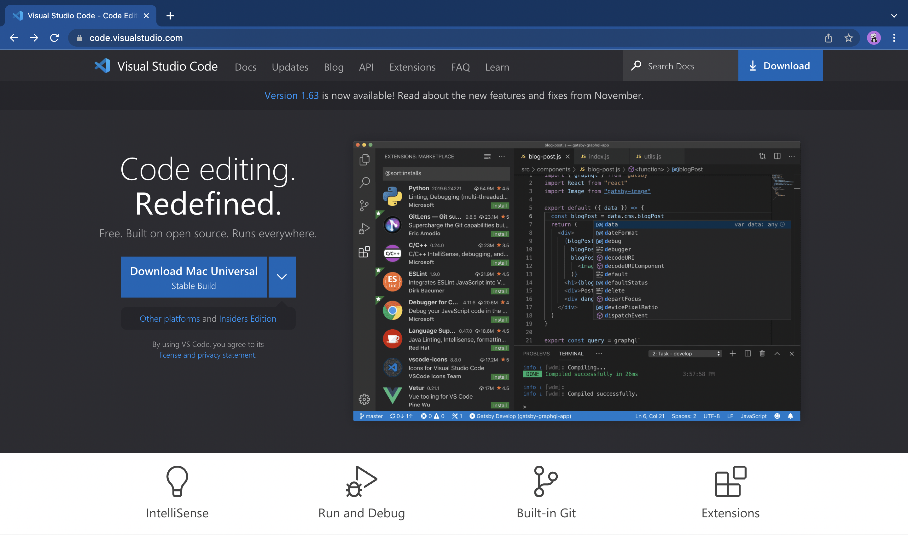
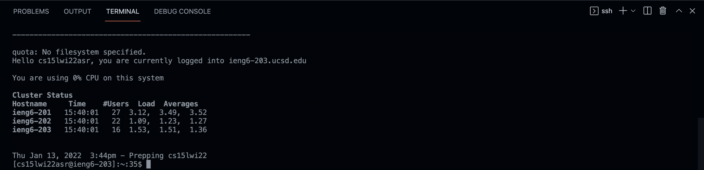

# Week 2 Lab Report
## CSE 15L: Getting Started

1. InstallingVSCode
    >First you are going to need a system that runs on OSX or Windows. Once you have that you can go to the [Visual Studio Code Website](https://code.visualstudio.com/). Here you can click the download button in the top right corner and download the version of VSCode for your operating system.  
    Once installed, you can open the application to this window:  Now Visual Studio Code is installed and ready to use!
    >
2. Remotely Connecting (OSX ONLY)
    >The first thing you need to do is go to the [UCSD Account Lookup Page](https://sdacs.ucsd.edu/~icc/index.php), find the account associated with CSE 15L, and reset your password to activate your account. Next, open VSCode and open a new terminal: 
    Once you open a new terminal, you can type in the command: ssh "your course-specific account" and press return. Since it is your first time connecting to this server, say "yes" to the prompt and press return. Now you should be prompted for your password and once you enter that, your terminal should look like this: 

    >
3. Trying Some Commands
4.
5.
6.