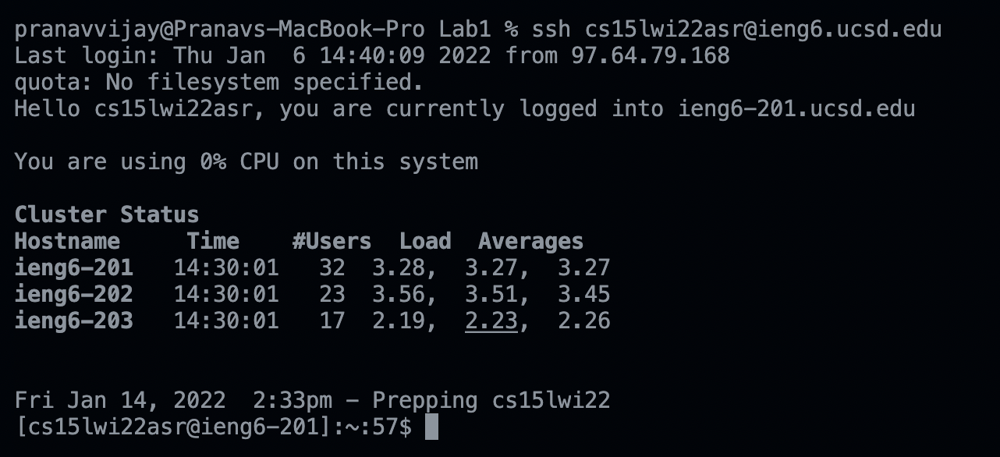

# Week 2 Lab Report
## CSE 15L: Getting Started

**Disclaimer: Do not type quotations around commands as shown unless otherwise stated**
1. Installing VSCode\
    First you are going to need a system that runs on OSX or Windows. Once you have that you can go to the [Visual Studio Code Website](https://code.visualstudio.com/). Here you can click the download button in the top right corner and download the version of VSCode for your operating system.  
    Once installed, you can open the application to this window:  Now Visual Studio Code is installed and ready to use!
    
2. Remotely Connecting (OSX ONLY)\
    The first thing you need to do is go to the [UCSD Account Lookup Page](https://sdacs.ucsd.edu/~icc/index.php), find the account associated with CSE 15L, and reset your password to activate your account. Next, open VSCode and open a new terminal: 
    Once you open a new terminal, you can type in the command: `ssh "your course-specific account"` and press return. Since it is your first time connecting to this server, say `"yes"` to the prompt and press return. Now you should be prompted for your password and once you enter that, your terminal should look like this: 
    
3. Trying Some Commands\
    Now that we are logged into the server, we can run commands on UCSD's computers instead of our own! Here are several commands you can test in your terminal:
    1. `ls` (Prints the files in the current directory)
    2. `pwd` (See what directory the terminal is currently working with)
    3. `cd` (Change directories)
    4. `scp` (Copies a file from client and puts it onto the server)
    5. `exit` (Logs you out of the server)

    Here is the output of different variations of some of these commands:
    

4. Moving Files with `scp`\
    Like I said in the last step, the `scp` command copies a file from the client and puts it on to the server
    To use this command, you just need to type this on your client terminal: `scp "file name" "course specific account":~/`. The terminal will then prompt you to type in your password and once you enter that, your file will be copied over to the server. In the picture above, you can see the list of files in my directory before and after I used the `scp` command.
    
5. Setting an SSH Key (OSX ONLY)\
    Now we are going to use a program called `ssh-keygen` that allows you to login to the server without entering your password every time. You can start by typing in and returning `"ssh-keygen"` into your terminal. It will then prompt you to enter a file to save the key and then enter a passphrase. You can just copy the file given in () and then return through the passphrase to leave it empty. You will then get more terminal output saying where your identification and public key have been saved. Now to copy the public key to your .ssh directory, you will need to login as normal, use the command `"mkdir .ssh"`, logout and `scp "file path where public key was saved" "course specific account":~/.ssh/authorized_keys`. Once this is done, you should be able to `ssh` and `scp` from your client to the server without entering in your password as shown:
6. Optimizing Remote Running\
    Now to make running remote running even easier, you can start chaining commands together:As you can see in the picture above, I chained two commands together using `""` around both of the commands and `"&&"` between each file. You can also use `";"` instead of `"&&"` and if you don't put quotes around both commands, it will log you in to the server, run the first command, log you out, and run the rest of the commands. With this tool you can run commands directly to the server without explicitly logging in and this can help reduce run time significantly. For example here is me using the `"scp"` to copy over an edit I made to a file which now only takes me around 5 keystrokes and 5-10 seconds to do once I make my edit:  
    