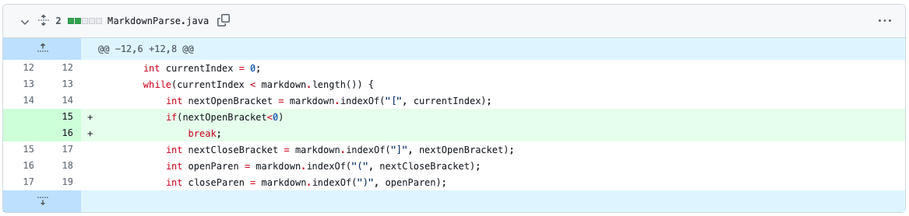
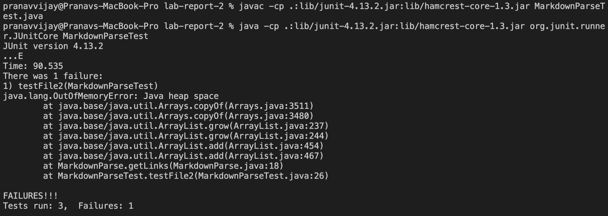
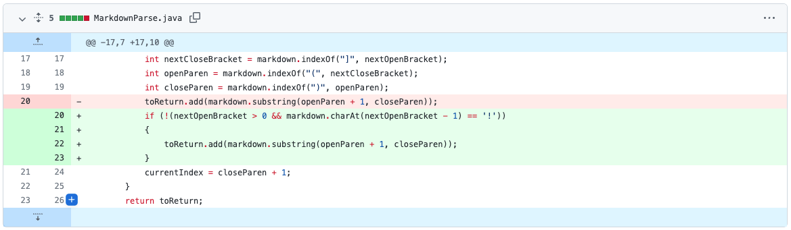
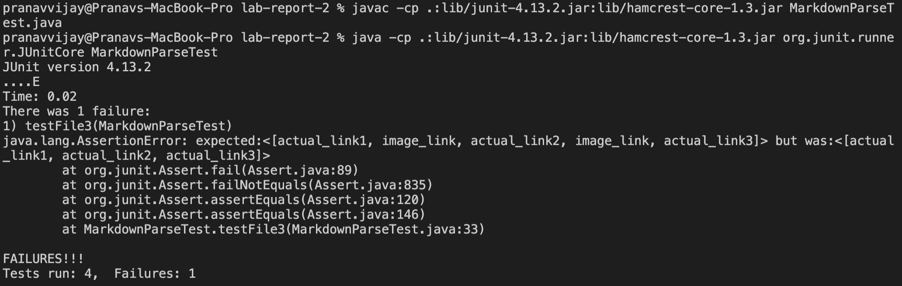
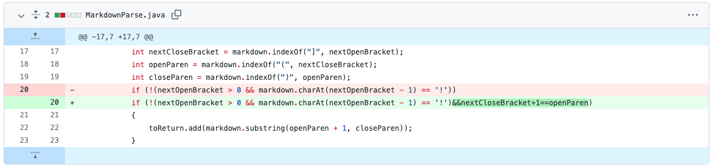
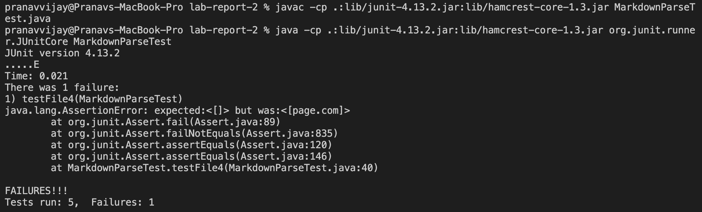

# Week 4 Lab Report
## Debugging

1. [failure-inducing input](test-file2.md) The failure-inducing input is an md with two correct links and then some random text afterwards. The output should be just the two links, but instead the symptom of the bug shows as an infinite loop. The bug was that the code did not have a way to check if the "stuff" after the last valid link was another link, so if it was not, `nextOpenBracket` would be set to `-1` resulting in the loop starting over indefinitely. The change in the code fixes this by checking if `nextOpenBracket` is less than `0` and breaking the loop if `true`.

2. [failure-inducing input](test-file3.md) The failure-inducing input is an md with three correct links and two images. The output should just be the three links, but instead the symptom of the bug is that the two images are also added to the loop. The bug was that the code did not check if a line was an image or a link. The change in the code fixes this by checking if there is an `!` before `nextOpenBracket` which would define that sequence(of `\'s`) as an image and not adding text in that sequence's parentheses to the list.

3. [failure-inducing input](test-file5.md)
The failure-inducing input is an md with a set of `[]'s` with text on one line and a set of `()'s` with text on another. Since they are not side by side, the output should be an empty list for no valid links, but instead the symptom of the bug adds the text in the `()'s` to the list. The bug was that the code did not check if the `[]'s` and the `()'s` were side by side to make sure it was be a valid link. The change in the code fixes this by check if there is a `]` 1 index to the left of a `(`, and not adding the text in the `()'s` to the list if `false`.