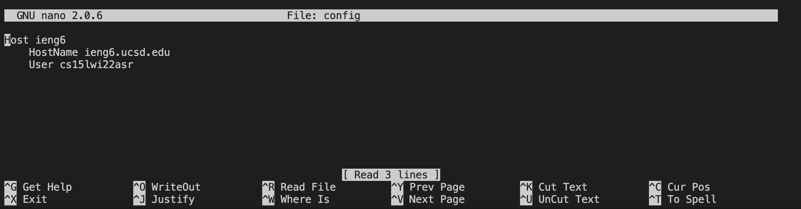
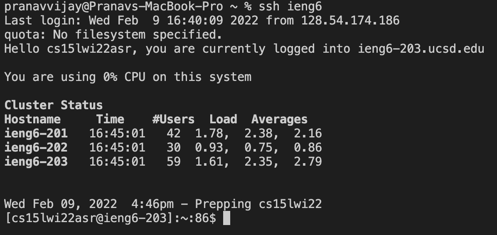
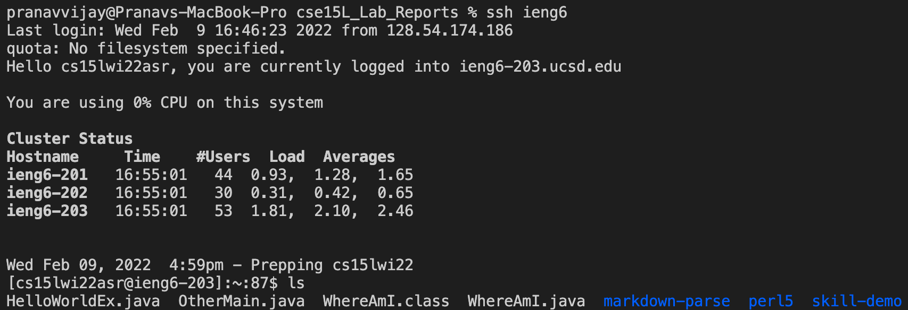
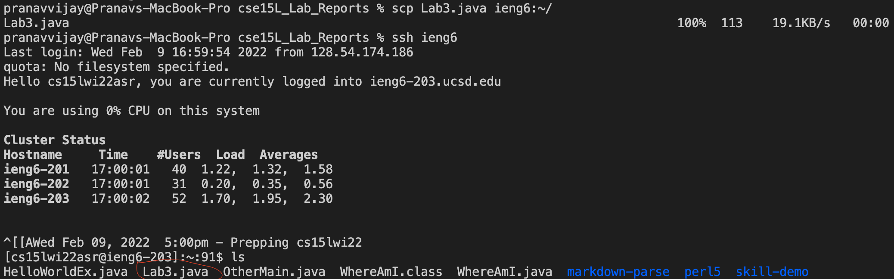

# Week 6 Lab Report
## Streamlining ssh Configuration
* To open and edit my `.ssh/config` file, I need to change directories to the ssh directory by entering `cd ~/.ssh`. Now that I am in the `ssh` directory, I can enter the `nano config` command to open my config file where I can make edits in the window as shown in the image below.
These lines: 
```
Host ieng6
    HostName ieng6.ucsd.edu
    User cs15lwi22asr
```
are what I entered into my window. If I make an edit, I can just use the keystrokes `control x` to exit and `y` to save the changes.

* Here is me using the `ssh` command to log me into my account using just the alias I chose:

All I had to enter was `ssh ieng6` in order to log in to my account when previously I had to type out my entire account name.
* At the bottom of the image below is the list of files in my account before the update:

Now from my client, I created a new java file `Lab3.java`. To copy this file over to the server, all I need to do is enter `scp Lab3.java ieng6:~/` instead of my entire account name. When I look at the list of files again using the `ls` command, `Lab3.java` is now copied to the server under my account.
