# Week 8 Lab Report
## MarkdownParse Testing
**Snippet 1:** My implementation failed to pass the Snippet 1 test. I think that there is a small code change that will make my program work for snippet 1 and all related cases that use inline code with backticks. I would just add an if statement to check if there is a ``` ` ``` before a  `[`, then the line should be invalidated and not count for any links.  \
My implementation:\
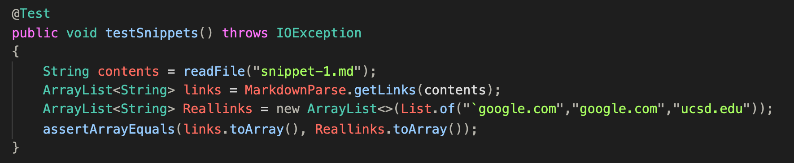
Failed:\
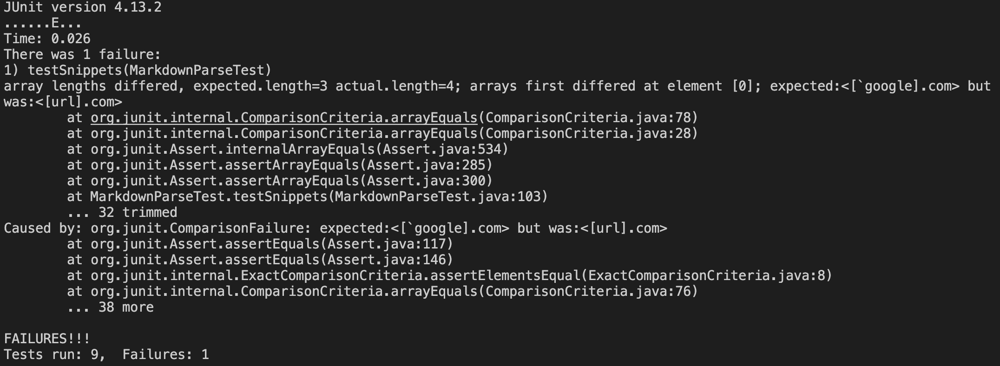
Reviewed implementation:\
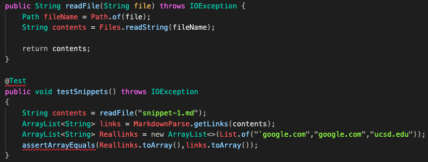
Failed:\

**Snippet 2:** My implementation failed to pass the Snippet 2 test. I think that there is a small code change that will make my program work for snippet 2 and all related cases that nest parentheses, brackets, and escaped brackets. This code change would involve searching from the back end of the line to check if the last character is a `)`, and if it is, it should be added to the list. It could also involve counting the number of close and open brackets and parentheses to check which links have been properly formatted and which have not; this would require a more involved code change.\
My implementation:\
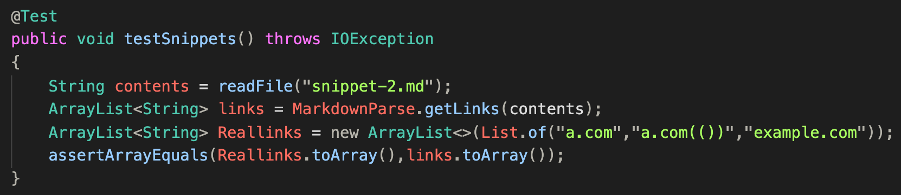
Failed:\
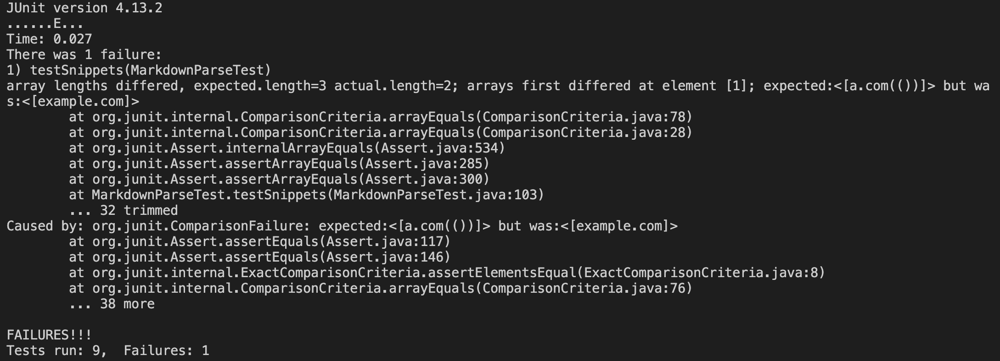
Reviewed implementation:\
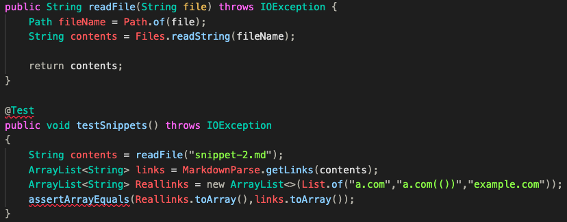
Failed:\
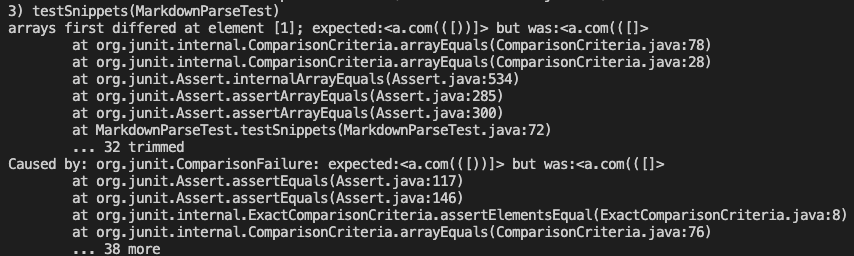
**Snippet 3:** My implementation failed to pass the Snippet 3 test. I think a more involeved code change will make my program work for snippet 3 and all related cases that have newlines in brackets and paranteheses. In my implementation of MarkdownParse, I looped through the text file line by line so it would be really difficult to make this fix without going through the entire text file as a whole first. After I set it up to search the entire text file, I would use regular expressions to cut all the white spaces, and then search through the entire text file similarly to how the original MarkdownParse did but with the addition of my extra checks. \
My implementation:\
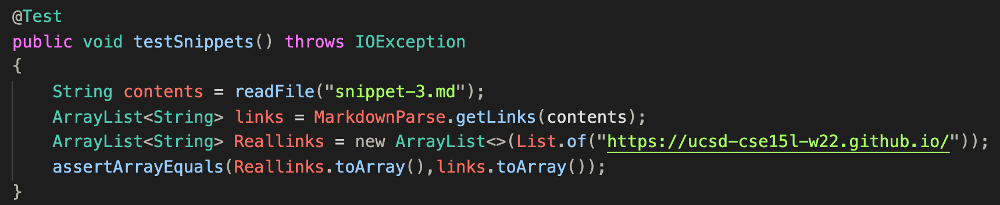
Failed:\
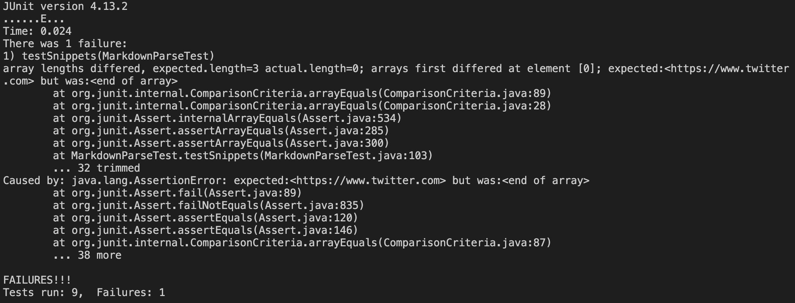
Reviewed implementation:\
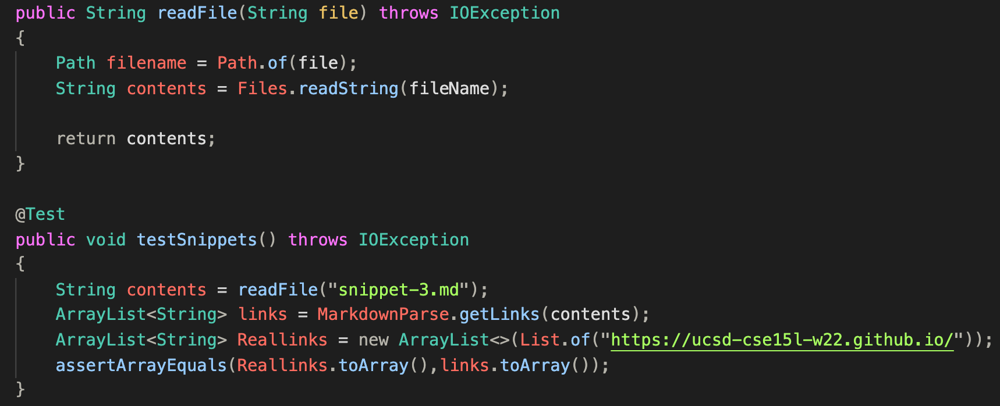
Failed:\
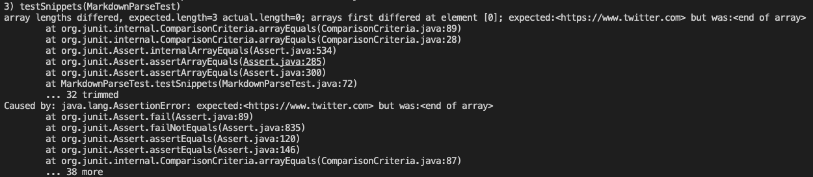
