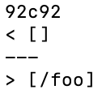
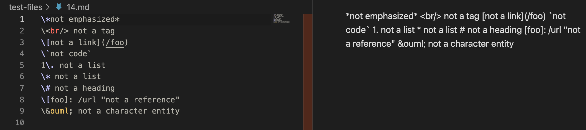
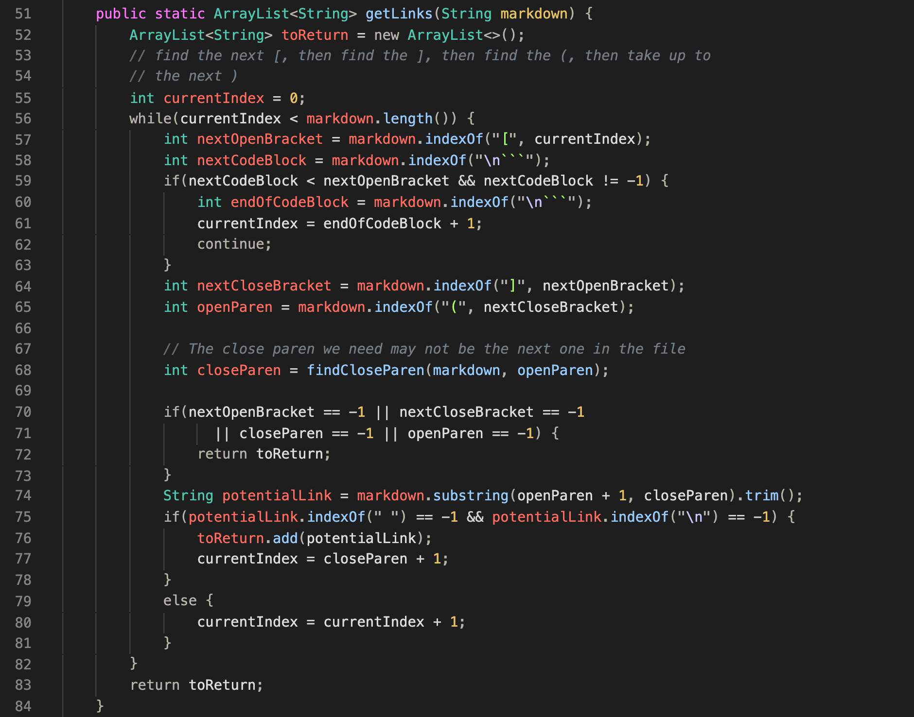
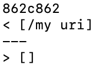
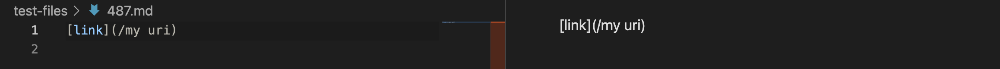
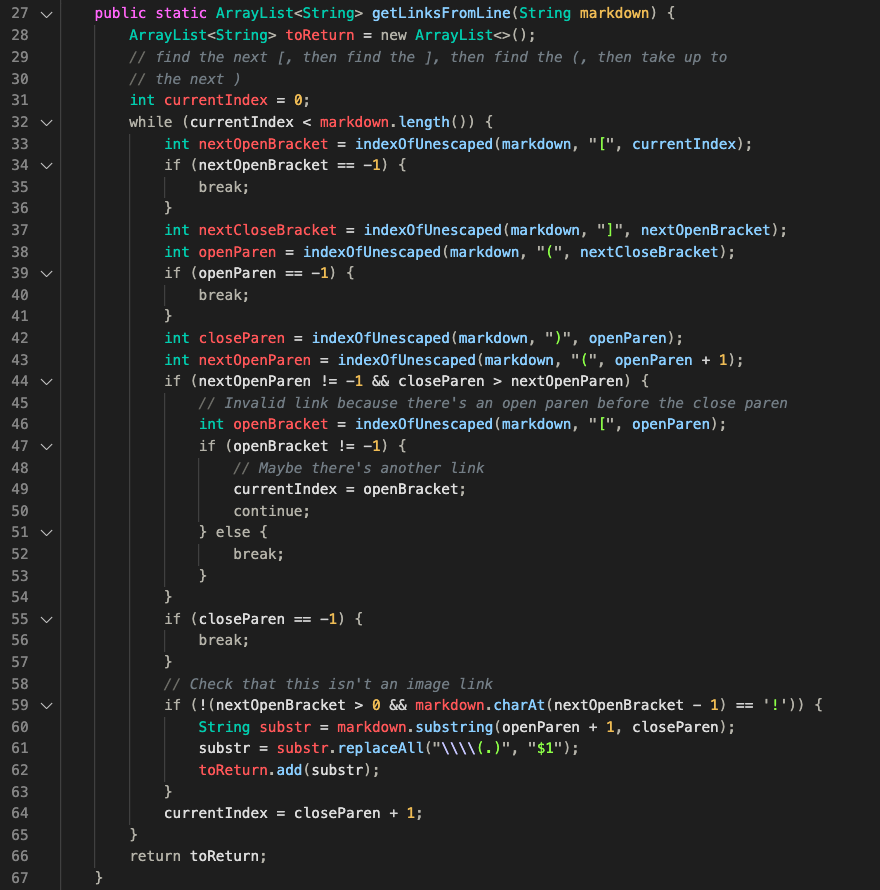

# Week 10 Lab Report
## My Implementation vs. Your Implementation
To find tests with different results, I ran `bash script.sh > results.txt` in my own MarkdownParse and the provided implementation of Markdown Parse. This command put the results of all the tests into one text file for each implementation. After that, I ran `diff lab9own/markdown-parse/results.txt lab9/markdown-parse/results.txt` to get a list of terminal output that told me what tests provided different results from implementation to implementation and what the differences were.\
**Test Difference 1:**  
\
In this first diff example, my implementation returned an empty array while the other implementation returned an array containing `\foo`. This test corresponds to test 14: \
As you can see on the preview screen on the right side, there are no links in the test file, so my implementation's output is correct and the other implementation's output is incorrect. The bug in the other implementation is that it does not check for backslash escape characters before an open bracket that would invalidate a link. This is the code in their implementation that should be fixed. After it finds the index of an open bracket on line 57, there should be an if statement checking if there is a `\` character at that index-1. And if there is, it should move on to the next open bracket.\
**Test Difference 2:**  
\
In this second diff example, my implementation returned an array containing `/my uri` while the other implementation returned an empty array. This test corresponds to test 487: \
As you can see on the preview screen on the right side, there are no links in the test file, so my implementation's output is incorrect and the other implementation's output is correct. The bug in my implementation is that it does not check for white space between characters inside the parentheses that would invalidate a link. This is the code in my implementation that should be fixed. Since we have the indeces of the open and close parentheses for the line after line 58, we could then use an if statement to check if there is a space between any of the characters within those parentheses. If there is, it should `break;` and move on to the next line.